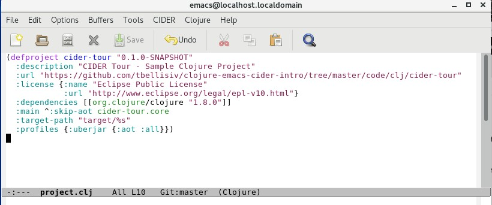
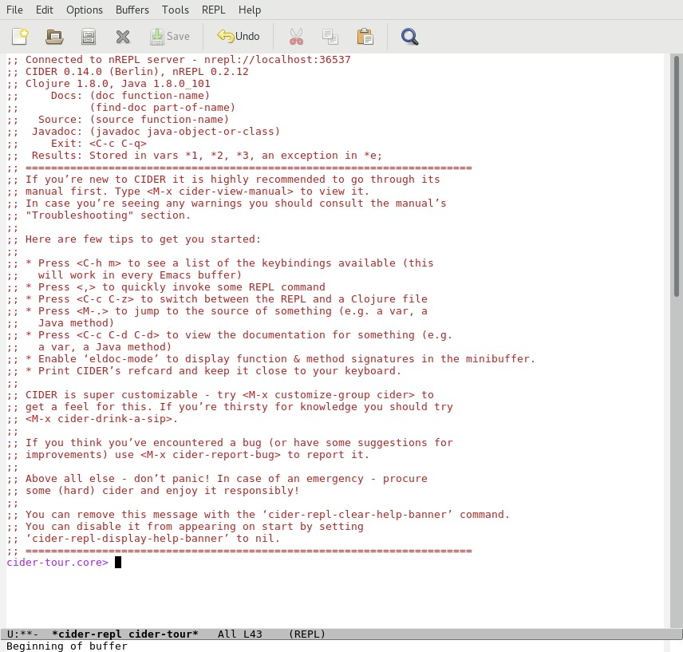

# Cider Mode

The [`clojure-mode`](https://github.com/clojure-emacs/clojure-mode) major mode provides the core language support for Clojure in Emacs however, the advanced features of CIDER such as code completion, interactive code evaluation, debugging and test execution require live interaction with the Clojure application running within a REPL. The `cider-mode` minor mode provides access to this functionality. `cider-mode` is the "meat" of CIDER.

`cider-mode` is automatically added as a minor mode to all buffers opened on Clojure source files within a project when a CIDER REPL session is started. `cider-mode` is removed from the buffers when the REPL session is terminated.

> **FYI**

> * Starting a CIDER REPL session is commonly referred to as "starting" CIDER".
> * Terminating a CIDER REPL session is commonly referred to as "stopping CIDER" (or "quitting CIDER").

# Starting CIDER

Let's start a REPL session on the cider-tour project.

In Emacs switch to the `project.clj` that you opened earlier: 

and do one of the following:

1. Select 'Start a REPL' from the 'CIDER' menu
2. Type `M-x cider-jack-in`
3. Type `C-c M-j`

In response, CIDER performs the following actions:

* Invokes Leiningen to start a new REPL background process
* Evaluates the `core.clj` file in the REPL.
* Sets the current namespace of the REPL to the namespace of the `core.clj` file (as indicated by the cider-tour.core&gt; prompt).
* Opens a buffer window for user interaction with the REPL.

CIDER displays a banner message in the REPL buffer that provides helpful information for new users:

