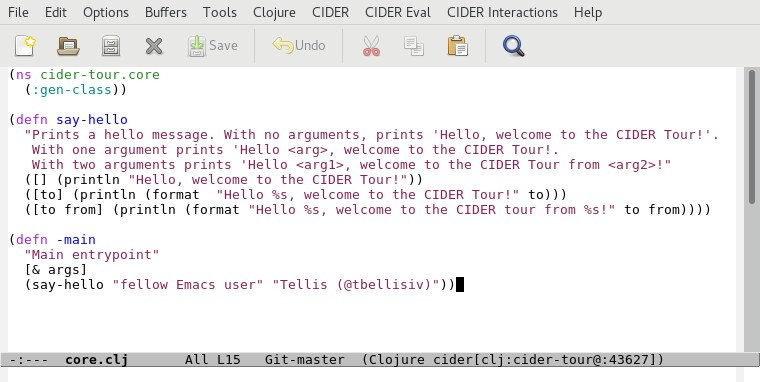

# Running Our Application

Now that we have some familiarity with Clojure concepts and syntax, lets turn our attention back to the cider-tour application.

In Emacs open the `core.clj` file in that resides under the `code/clj/cider-tour/src/cider-tour` directory of the GitHub repo.

**Screenshot - core.clj**

`core.clj` is generated by Leiningen to provide boilerplate code for the application's entry-point (by convention the `-main` method). It contains the following:

* A `ns` function call to set the namespace to `cider-tour.core` for all functions/vars defined in the file. This is conceptually similar to the `package` statement in Java source files.

* A `defn` function call to define a function named `say-hello`. `say-hello` is a [multi-arity](http://clojure-doc.org/articles/language/functions.html#multi-arity-functions) function whose behavior (the "Hello" text printed) depends on the number of arguments passed to the function.

* A `defn` function call to define a function named `-main` that invokes the `say-hello` function with two arguments.

