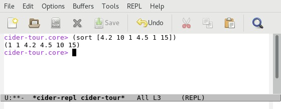
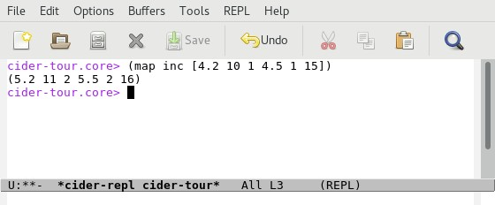
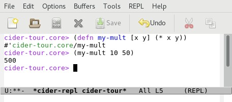
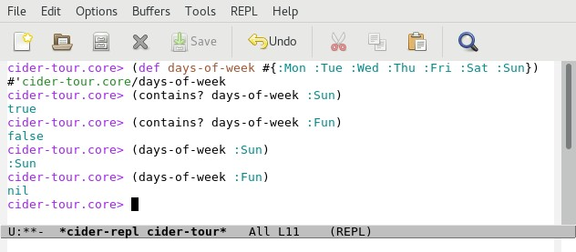
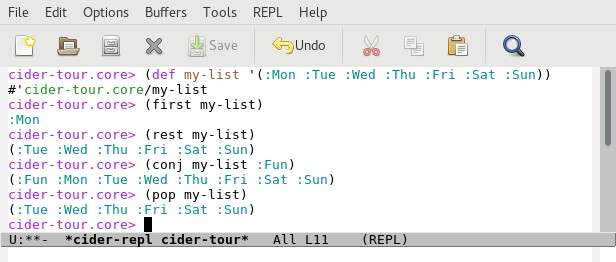

# Evaluating Code in the REPL

Now that we have a REPL session, let's explore some core concepts in Clojure- expressions, vars, functions and collections.

## Expressions

Calculate 1.4 * 67 :

`(* 1.4 67)`

**Output**

Print "Hello, world!":

`(println "Hello, world!")`

**Output**

Sort a Vector (Array) of Numbers:

`(sort [4.2 10 1 4.5 1 15])`

**Output**

Sum a Vector of Numbers:

`(reduce + [4.2 10 1 4.5 1 15])`

**Output**

Increment a Vector of Numbers:

`(map inc [4.2 10 1 4.5 1 15])`

**Output**

## Variables

### Using Variables (a.k.a. "vars")

Define a "var" with string content:

`(def my-string-var "Hello, world")`

Display the value of the var:

`my-string-var`

Display the length of the string

`(count my-string-var)`

**Output**

## Functions

### Defining Functions

Define a function that takes two integer arguments, `x` and `y`, and returns the product `x * y`:

`(defn my-mult [x y] (* x y))`

Invoke the function to multiply two numbers:

`(my-mult 10 50)`

**Output**

## Collections

### Vectors

Define a var that contains a [vector](https://clojure.org/reference/data_structures#Vectors) of [keywords](https://clojure.org/reference/data_structures#Keywords) representing states:

`(def valid-states [:stopped :stopping :running])`

Add elements to the vector:

`(conj valid-states :starting :paused)`

Return the third element of the vector:

`(get valid-states 2)`

**Output**

### Maps

Define a var that contains a [map](https://clojure.org/reference/data_structures#Maps) which maps states to strings suitable for display in a UI: 

`(def state-display-vals {:stopped "Stopped" :stopping "Stopping" :running "Running"})`

Get the display value for the _:stopped_ state:

`(:stopped state-display-vals)`

Added a mapping for the _:starting_ state:

`(assoc state-display-vals :starting "Starting")`

**Output**

### Sets

Define a var that contains a [set](https://clojure.org/reference/data_structures#Sets) of keywords for the days of the week:

`(def my-set #{:Mon :Tue :Wed :Thu :Fri :Sat :Sun})`

Check set membership:

`(contains? days-of-week :Sun)`

`(contains? days-of-week :Fun)`

Return a member if it exists, otherwise return nil:

`(days-of-week :Sun)`

`(days-of-week :Fun)`

**Output**

### Lists

Define a var that contains a [list](https://clojure.org/reference/data_structures#Lists) of days of the week:

`(def my-list '(:Mon :Tue :Wed :Thu :Fri :Sat :Sun))`

Get the first element in the list:

`(first my-list)`

Return a new list consisting of all elements in the list except the first:

`(rest my-list)`

Return a new list consisting of all elements in the list with a new element prepended:

`(conj my-list :Fun)`

**Output**

